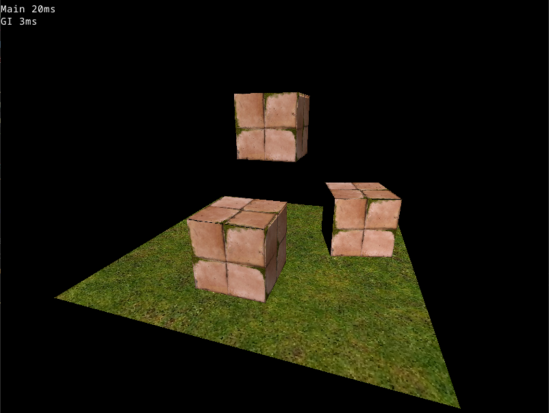

# ray-traced-shadows
Ray traced shadows algorithm in Rust

Work in progress...

Study case of calculating shadows by testing collisions between a ray starting from the texture pixel to the light, passing through all vertices in the scene.

It's single-threaded and runs in the CPU, for simplicity's sake.

Keys: A, D, Q, E for rotation and W, S, R, F for translation

Current state:  